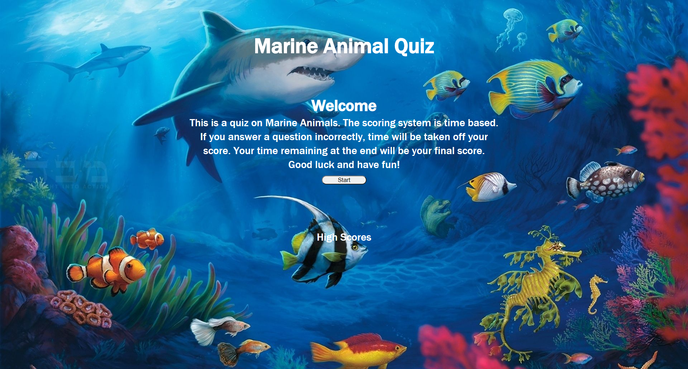

# Marine-Animal-Quiz

# Purpose

A quiz to test the user's knowledge of Marine Animals and to hopefully learn something they did not know.

# Contents

<ul>
    <li><a href="#built-with">Built With</a></li>
    <li><a href="#features">Features</a></li>
    <li><a href="#website">Website</a></li>
    <li><a href="#contributions">Contributions</a></li>
</ul>

# Built With

<ul id="built-with">
    <li>HTML</li>
    <li>CSS</li>
    <li>JavaScript</li>
</ul>

# Features

<ul id="features">
    <li>When loaded user is greeted with a Welcome page.<li>
    <li>When the start button is clicked, a timer starts and first question appears.</li>
    <li>An alert appears to let user know if they were correct or incorrect.</li>
    <li>Time is reduced for incorrect answers.</li>
    <li>Scores are saved and put into a highscore page.</li>
</ul>

# Website

<a href="https://dmorrel7.github.io/Marine-Animal-Quiz/">Marine Animal Quiz</a>

# Contributions

<ul id="contributions">
    <li>The website W3 Schools</li>
    <li>The website stackoverflow</li>
    <li>Mike Lochman, a friend that is also a programmer</li>
</ul>
